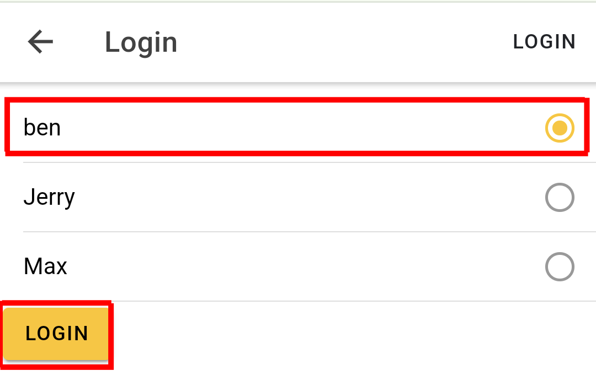
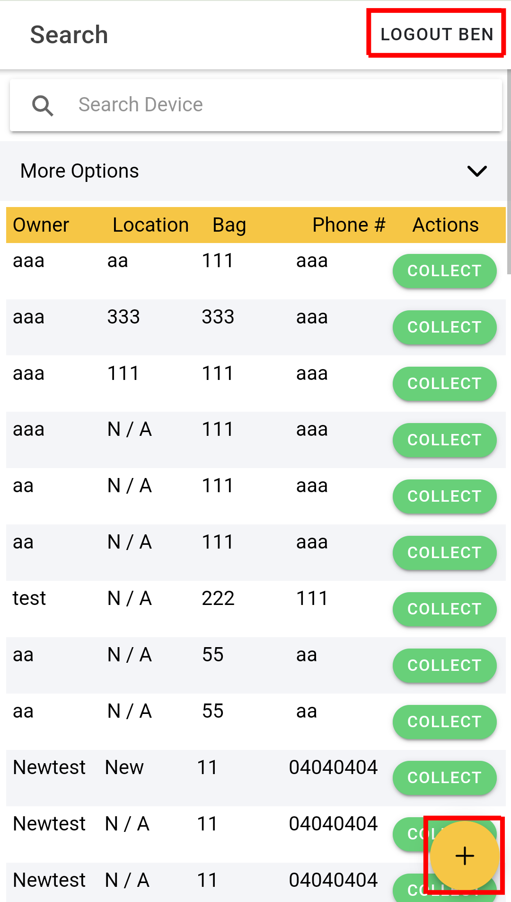
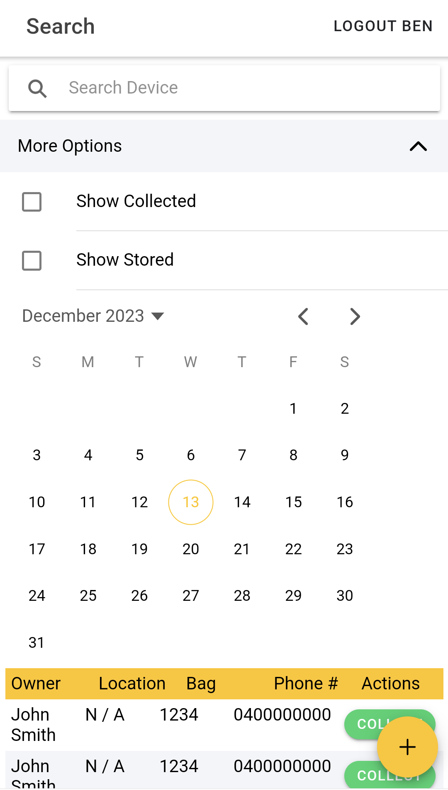
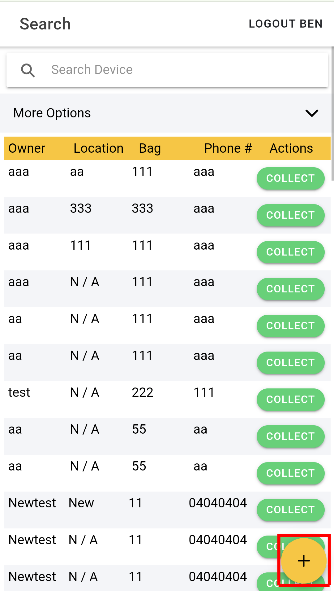
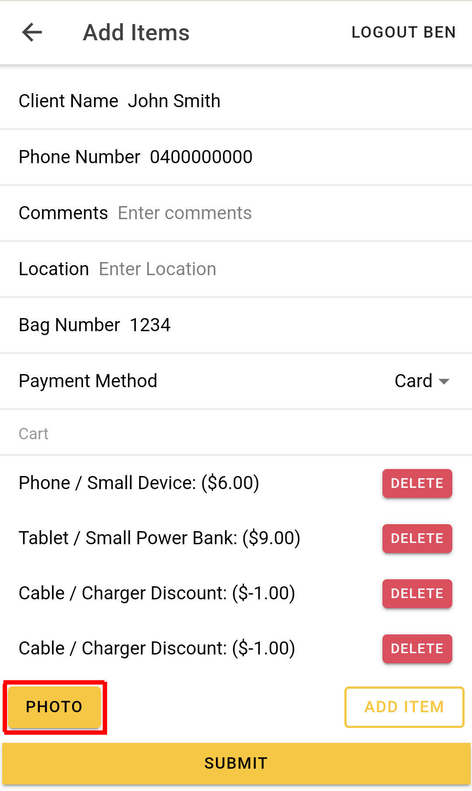
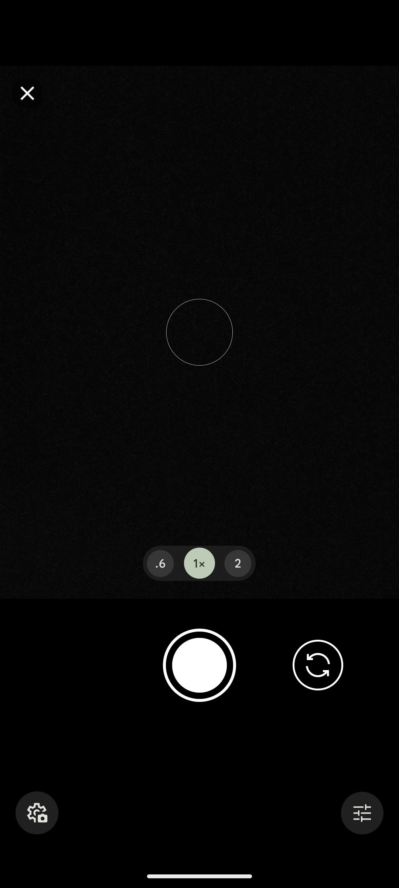
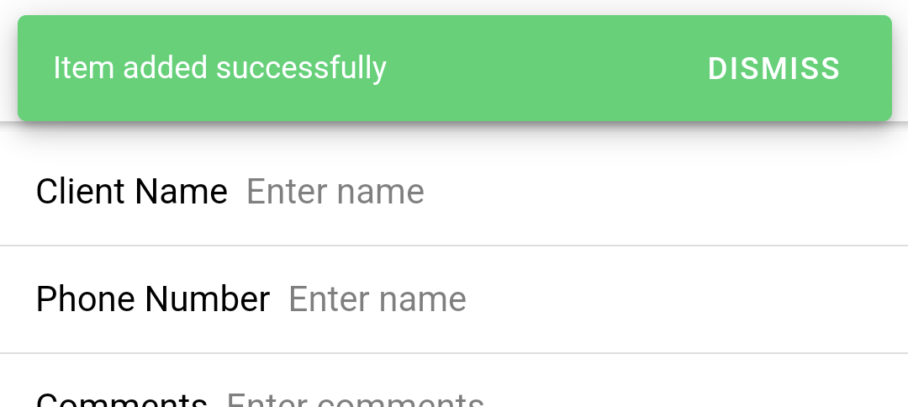
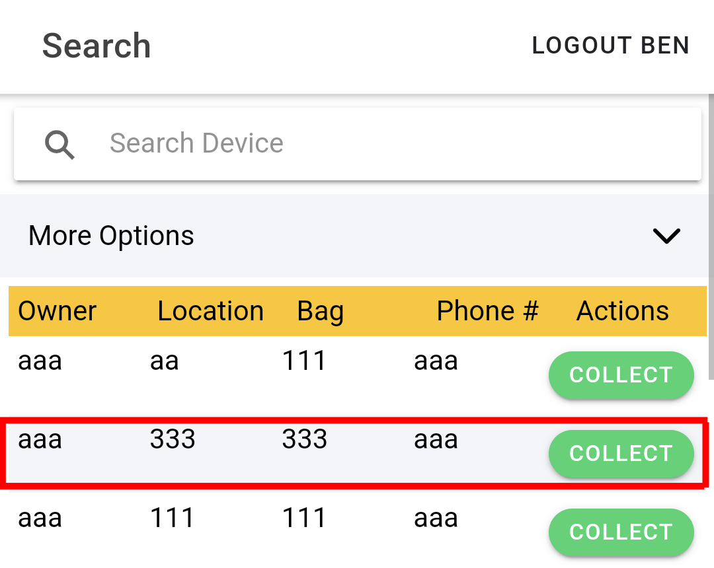
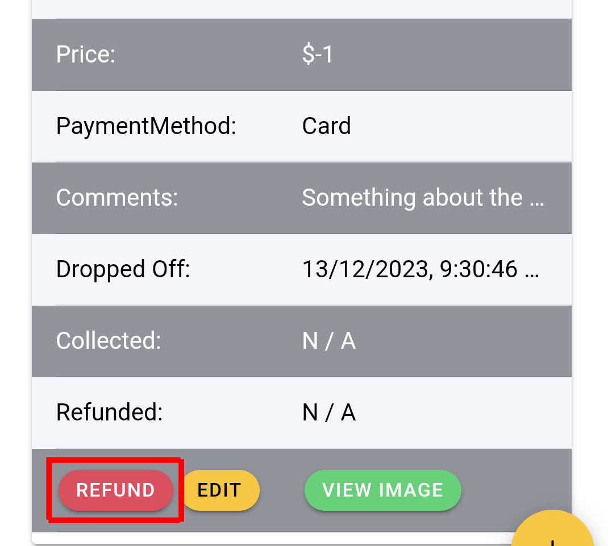
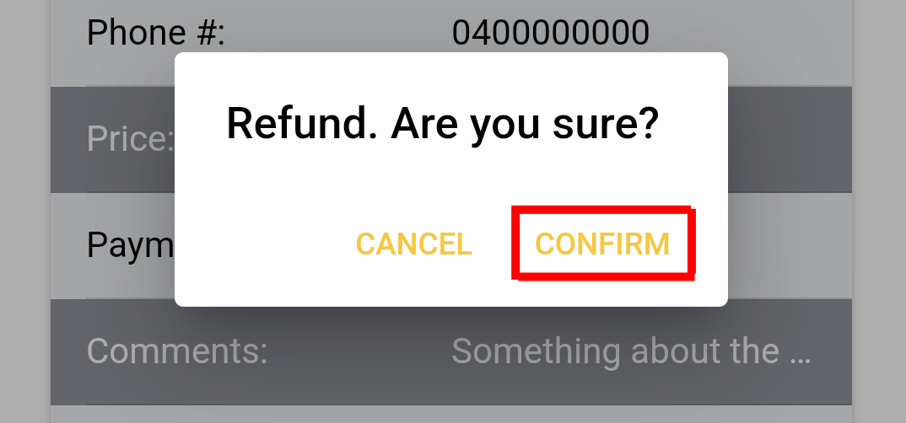

### User Guide

  
Table of Contents

  <ul>
  <li>
      <a href="#logging-in">Logging in</a>
    </li>
    <li>
      <a href="#searching">Searching</a>
    </li>
    <li>
      <a href="#cashier-tasks">Cashier Tasks</a>
    </li>
    <ul>
        <li><a href="#adding-a-new-item">Adding a New Item</a></li> 
        <li><a href="#giving-a-refund">Giving a Refund</a></li>
    </ul>
    <li>
      <a href="#assistant-tasks">Assistant Tasks</a>
    </li>
    <ul>
        <li><a href="#editing-an-existing-item">Editing an Existing Item</a></li> 
        <li><a href="#collecting-an-item">Collecting an Item</a></li>
    </ul>
   </ul>

## Logging in

To log in, click the **LOGIN button** in the top-left corner of the screen

First, **select your name from the list**, then click the **LOGIN button**

You may verify that you have logged in successfully by the presence of the **LOGOUT** button or the **+/add** button

(<a href="#user-guide">back to top</a>)

## Searching

To perform a search, you need to be on the search screen. _If you are on the "Add Items" or "Login" screen, you will need to return to the search screen by pressing the **back button**_

You can then use the search bar to search by

- Client Name
- Phone Number
- Storage Location
- Comment

And / Or, expand the dropdown to filter by

- Date
- Collected Status
- Location Status

(<a href="#user-guide">back to top</a>)

## Cashier Tasks

### Adding a New Item

_To add new items to the system, you must be logged in. For details on how to log in please view <a href="#logging-in">Logging in</a>_

To add a new item, start by clicking the **+/add** button. This will open the "Add Items" screen

The "Add Items" screen consists of a form to input the details of the client and their items

By default, **you must fill all fields in this form other than**

- Comments
- Location

You can add any items and discounts to the cart by using the **ADD ITEM** button to open the **item menu**

_Please click the **ADD ITEM** button as many times as needed, until all items are in the cart_

**Press the item** or **discount** you want to add. _This will dismiss the menu_

You may remove items added to the cart by pressing their unique **DELETE** button

To add a photo of the items being collected, press the **PHOTO** button

This will open your system's camera dialogue. _For example (android)_

You may verify if the photo has been taken successfully by the **presence of the View Photo button**, which may also be used to view the photo

If the details have been added correctly, and you are happy with the photo, you can add the item using the **SUBMIT** button

If there is an issue with the form data, such as a required field being missing, an error with more information will appear at the top of the screen

If no errors occur, you will be prompted to collect payment from the client. **Pressing confirm will add the items to the system**

If the items are added successfully, a green status message will display at the top of the screen and the form will be reset and ready to add another device

(<a href="#user-guide">back to top</a>)

### Giving a Refund

_To refund an item you must be logged in. For details on how to log in please view <a href="#logging-in">Logging in</a>_

_To refund an item, you will need to search for that item in the system. For details please view <a href="#searching">searching</a>_

Once the item to be refunded has been located, **press the row to expand**

Then, at the bottom of the expanded row, press the **REFUND button**

When prompted, press **CONFIRM** to process the refund

(<a href="#user-guide">back to top</a>)

## Assistant Tasks

### Editing an Existing Item

_To edit an item you must be logged in. For details on how to log in please view <a href="#logging-in">Logging in</a>_

_To edit an item, you will need to search for that item in the system. For details please view <a href="#searching">searching</a>_

Once the item to be edited has been located, **press the row to expand**

Then, at the bottom of the expanded row, press the **EDIT button**. This will open the "Edit Items" screen

On the "Edit Items" screen, you can make any changes you need by editing the fields in the form. Then, press the **SUBMIT BUTTON** to save the changes

_Note: You may not use this page to add additional items. If changing the item type, delete the item from the cart, then replace it using the **ADD ITEM button**_

If there is an issue with the form data, such as a required field being missing, an error with more information will appear at the top of the screen

If no errors occur, you will be redirected to the search screen and a green success message will display

(<a href="#user-guide">back to top</a>)

### Collecting an Item

_To mark an item as "collected" you must be logged in. For details on how to log in please view <a href="#logging-in">Logging in</a>_

_To mark an item as "collected", you will need to search for that item in the system. For details please view <a href="#searching">searching</a>_

Once the item to be marked as "collected" has been located, press the **COLLECT button** to mark it as "collected"

Press the **CONFIRM button** to confirm the collection

If the collection was successful, a green success message will appear at the top of the screen

(<a href="#user-guide">back to top</a>)

